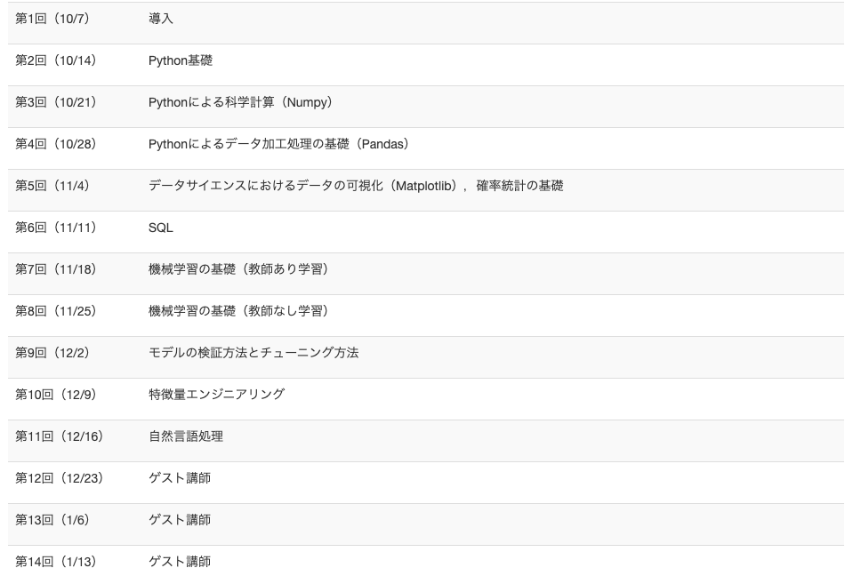

# [東京大学グローバル消費インテリジェンス寄附講座(GCI2020Winter)](https://gci.t.u-tokyo.ac.jp/gci-2020-winter/)

**[Hirochonさんのレポジトリ](https://github.com/Hirochon/GCI2020-Summer/)を参考に自分もGCIの取り組み(主にコンペについて)をまとめてみました!**

## このリポジトリの作成経緯
- 自分がプログラミング、データサイエンスやKaggleに触れるきっかけになったのがこの講座でした
- ふとGCIでプログラミングに触れたてのコードをみていると、下手だなみたいな箇所やこんな書き方してたっけみたいな感じでしみじみしたのでgitにまとめようと思った矢先、先駆者様(Hirochonさん)がいたので一方的に真似させて頂きました
- 過去の記憶を辿りながら書いているので見るに堪えないものかもしれませんが寛大なこころで読んでいただきたいです。。。

## 講座

- **東京大学の松尾研究室が主催する東京大学グローバル消費インテリジェンス寄附講座(GCI2020Summer)**という**データサイエンティストを育成する講座**
- 期間としては2020年10月上旬〜2021年1月下旬の約4ヶ月間
- 受講生は約900名(slackを参考に記述、修了者がどれくらいいたかは不明)
- その他詳しいことは[公式リンク](https://gci.t.u-tokyo.ac.jp/gci-2020-winter/)を見た方が早いかも
- カリキュラムは以下の通り

引用: https://gci.t.u-tokyo.ac.jp/gci-2020-winter/

## コンペ
- 一言で言うとGCI受講者間で行われるKaggleのようなコンペティション
- これが全3回ありました
- コンペ自体が楽しくて楽しくてサブミットを極力していたため3回とも入賞できました！
  - 第一回(1位) 
  - 第二回(4位)
  - 第三回(5位)
- 基本的にKaggleのノートブックを参考にして、EDAや特徴量エンジニアリングしてみたりとめちゃくちゃ勉強になりました
  - 今の自分があるのはここである程度基礎的なことが理解できたことと、プログラミングやデータサイエンスの自習の仕方を学べたのが大きいです
